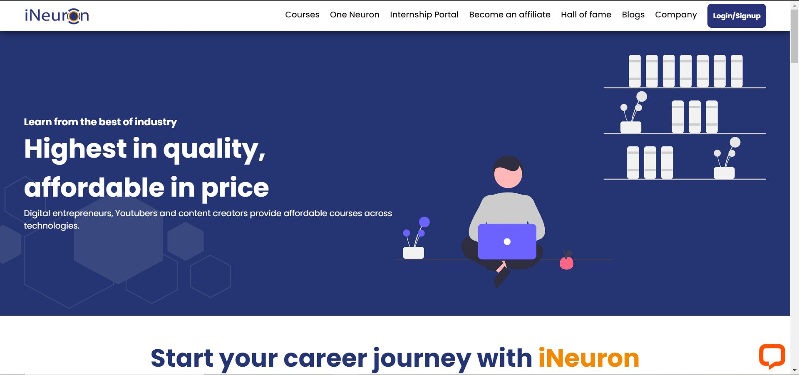
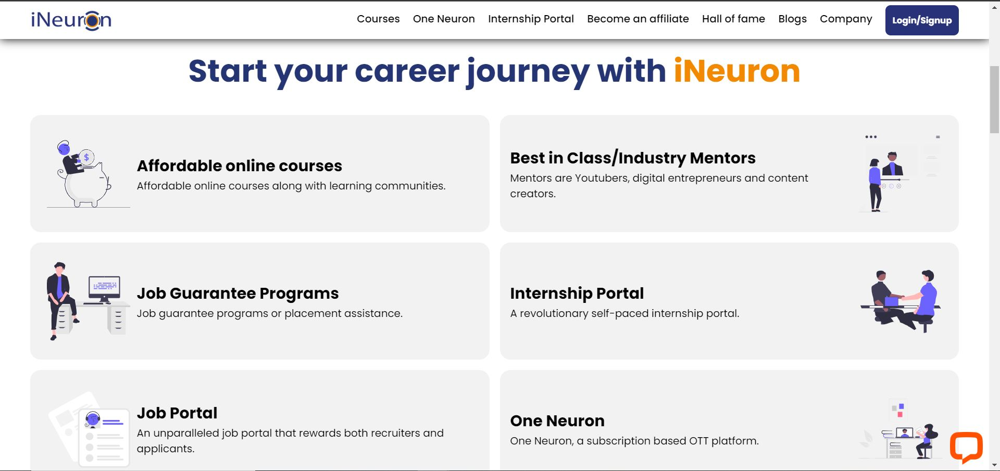
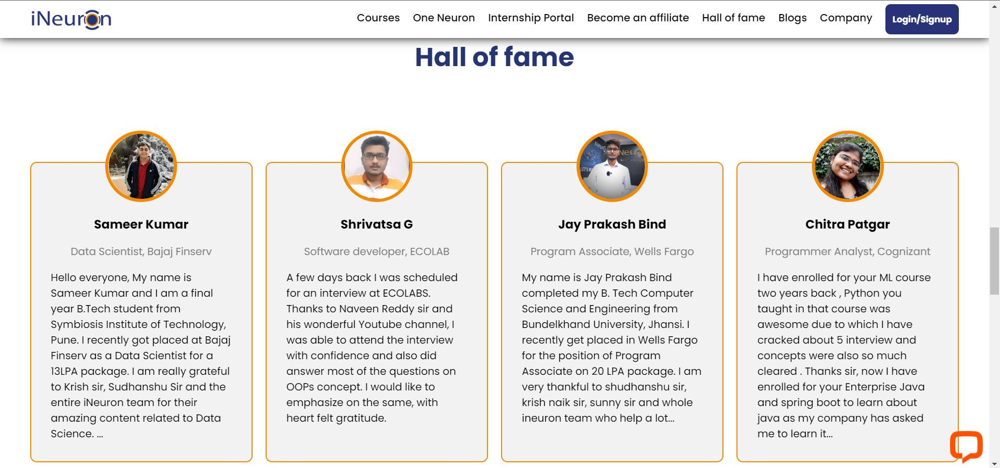
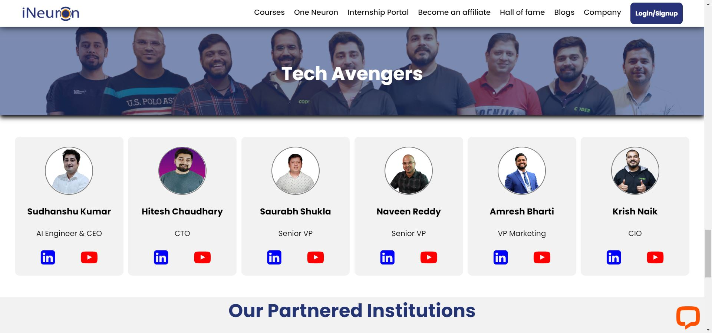
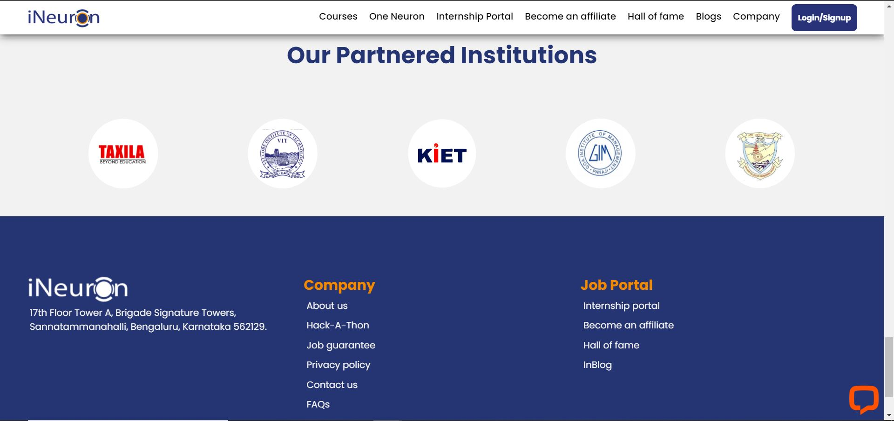

# iNeuron Home Page
Designed iNeuron Home page for hackathon organized by iNeuron. Technologies used in this project are  and . 

## Learnings
- Designing Website
- Basic transitions using CSS
- Using layout module like Flexbox and Grid
- Making website responsive

## Time to finish the Project
- Approx 10 hours

## Demo
[Click here to view Demo](https://www.youtube.com/watch?v=C6bSiJFGDTE)

## Live project link
[https://sumitjeswani-ineuron-homepage.netlify.app/](https://sumitjeswani-ineuron-homepage.netlify.app/)
## Sneak peek

